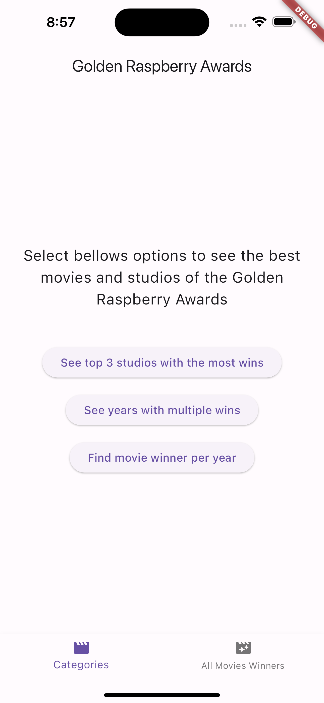
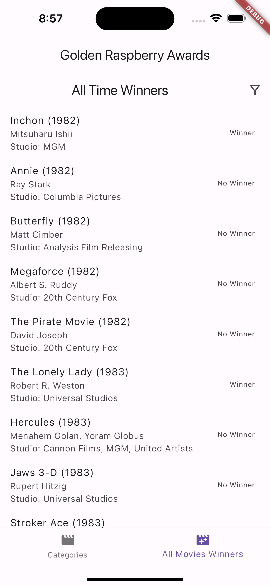
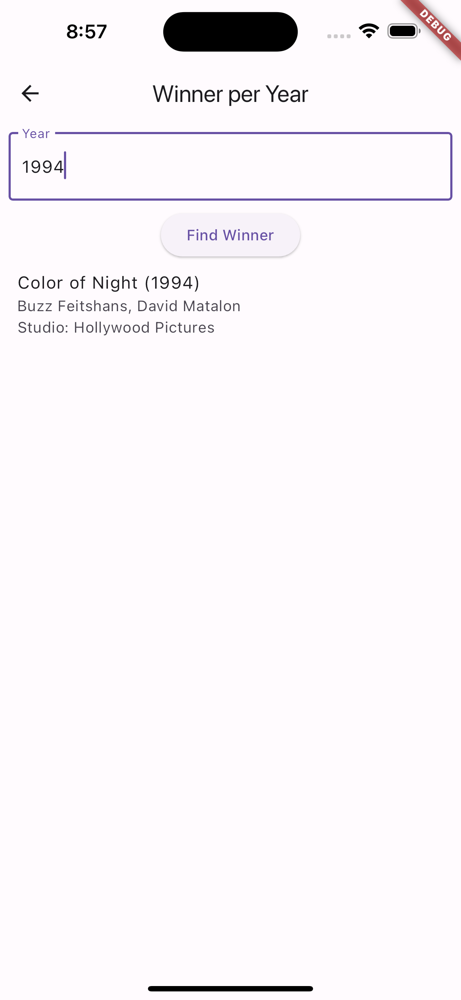
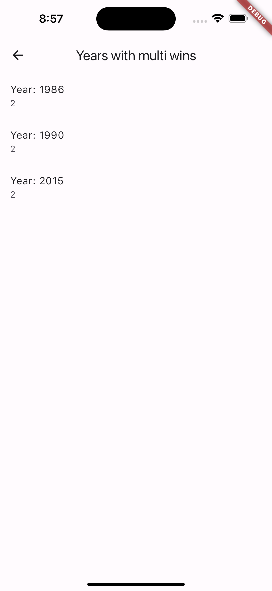
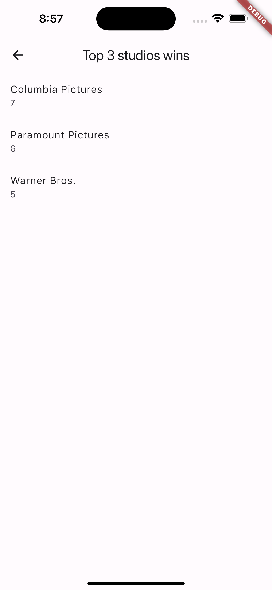

# app_golden_raspberry_awards

This project provides an app to consult and access some dashboards about the golden raspberry awards.

### - The project is in development.
### - The project is not ready for production. 
### - The project is not ready for use.

|| |
|||
|

# Architecture

The project uses Clean Architecture, divided into several layers:  

- **Data**: This layer includes the data sources and repositories.
- **Domain**: This layer includes the use cases and entities.
- **Presentation**: This layer includes the UI and the business logic.  

The project has the package-feature approach, and it is divided into the following packages:

- **configs**: This package includes the app's configurations and routes.  
- **shareds**: This package includes the shared code of the app.
- **main**: This package includes the main code of the app.  
- **features**: This package includes the features of the app. Each feature is a separate package and its structure respects Clean Architecture Layers.

## Mains packages used
- **Futter Bloc**: State management.
- **get_it** and **injectable**: For Dependency injection.
- **dio**: HTTP requests.

## Getting Started

These instructions will get you a copy of the project up and running on your local machine for development and testing purposes.

### Running the app manually
1. Go to main project path
2. Update the dependencies: `flutter pub get`
3. Run the app: `flutter run`

### Running the app from Visual Studio Code or Android Studio IDE
1. Open the project in Visual Studio Code or Android Studio IDE.
2. Run the app in IDE.

### Download the compiled version for android
1. For download click on the link: https://drive.google.com/file/d/1W5IV7ux7E8ADZdeurSH9oyXVRouEzeCx/view
